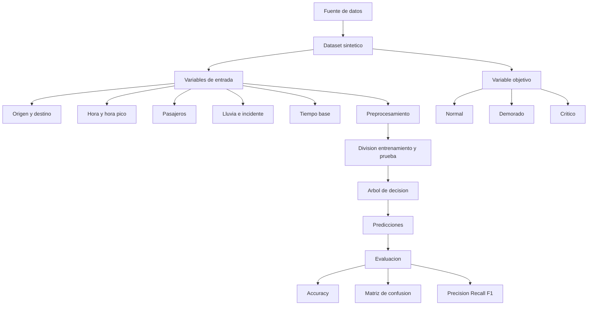

# Mapa conceptual - Aprendizaje supervisado aplicado a Transmetro

## Idea central

El aprendizaje supervisado utiliza ejemplos que ya tienen una etiqueta conocida. En este proyecto, cada registro contiene condiciones del recorrido y un estado del servicio. El árbol de decisión aprende patrones de los datos de entrenamiento y posteriormente clasifica registros que no utilizó durante el aprendizaje.
